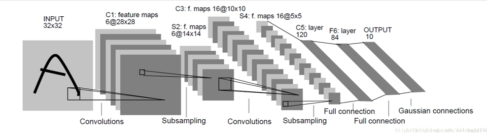
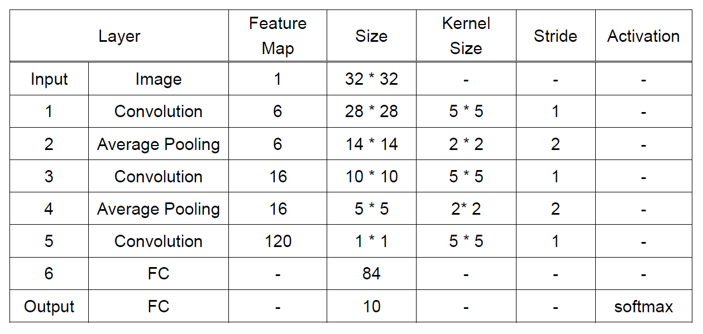
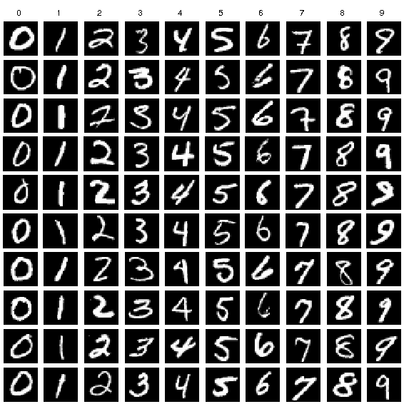
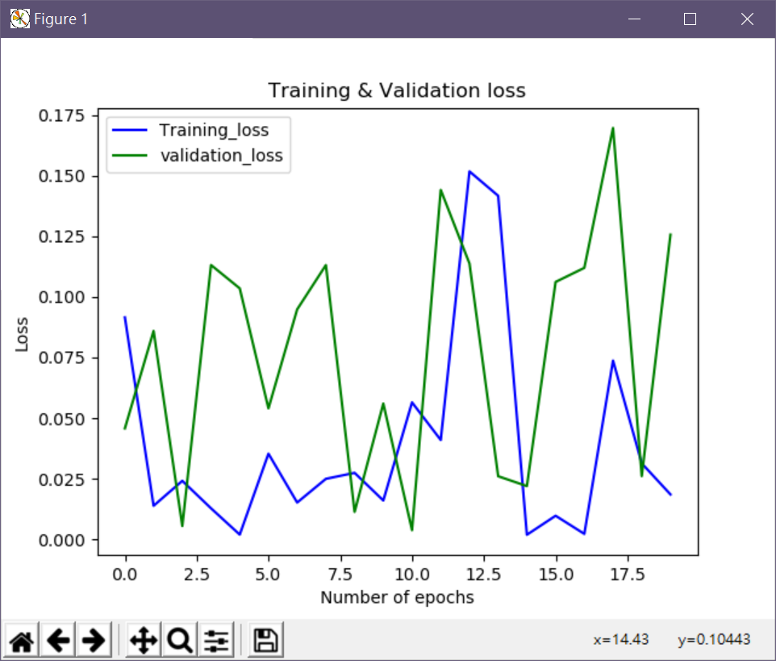
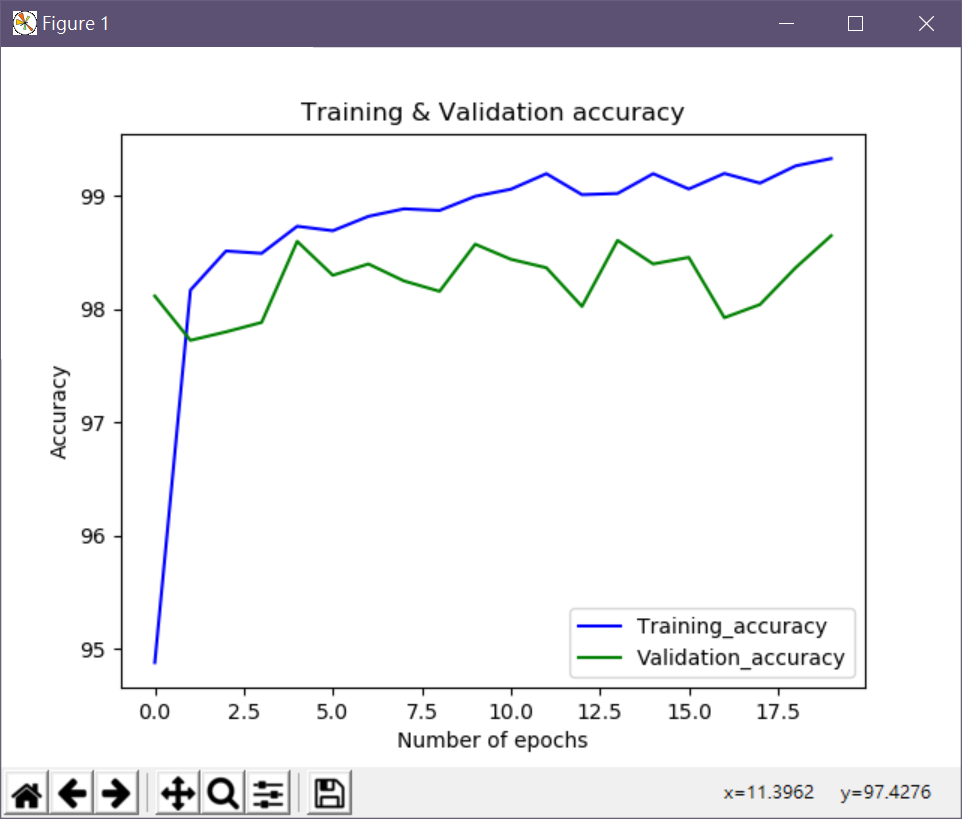

# Midterm Project
NQU CSIE Shih-Yin Chen (資工三-110610529-陳士茵)

> 實驗報告 <br>
> 利用**卷積神經網路模型(CNN)**，做資料集(datasets)的 **MNIST手寫數字識別**。

# Outline
**1. Introduction <br>**
  &emsp;　What is CNN Model? <br>
  &emsp;　LeNet 5 <br>
  &emsp;　What is MNIST? <br>

**2. Related Work <br>**
  &emsp;　How to create the CNN Model? <br>
  &emsp;　Train Data & Test Data <br>

**3. Experiment <br>**
  &emsp;  Explain <br>
  &emsp;  Experimental Results and Analysis <br>
<br>


~ ~ ~ ~ ~ :blush:

先簡單介紹知識點，再詳細說明使用的過程。

* 報告內容分為三部分：<br>
  **Part 1- 簡介**：　分別介紹 <br>
  **Part 2- 相關工作部分**： 實現模型　<br>
  **Part 3- 實驗部分**： 說明實驗過程
<br>

------
# <font color="DD6708"> 1. Introduction </font>
## What is CNN Model?
* Convolutional Neural Network (CNN) 
* Structure:
  * 輸入層
  * 隱藏層
    * 卷積層
    * 池化層
  * 輸出層

## LeNet 5
* 共七層 
  
* Structure: 
  
<br>

## What is MNIST?
* 是 手寫數字資料庫
* Dataset: MNIST
* MNIST contains 70,000 images of handwritten digits:
  *  60,000 for training 
  *  10,000 for testing
* The images are grayscale(灰階值), 28x28 pixels
* 分類 手寫數字 0 ~ 9 
  
<br>

-----
# <font color="DD6708"> 2. Related Work </font>
## How to create the CNN Model?
1. Prepare the Data.
2. Define the Model.
3. Train the Model.
4. Evaluate the Model.
5. Make Predictions

## Train Data & Test Data
### **結論：訓練集的理想結果 & 測試集的實際識別結果**
1. 訓練集的**損失率**比測試集**低**
<br>


<br>

2. 訓練集的**準確率**比測試集**高**
<br>


<br>

-----
# <font color="DD6708"> 3. Experiment </font>
## Explain
* 使用測試資料評估 Model 的 **損失函數誤差值** 與 **準確率**

1. Import Libraries
   ```
  import torch
  import torchvision as tv
  import torchvision.transforms as transforms
  import torch.nn as nn
  import torch.optim as optim
  import argparse
   ```
2. 資料預處理
3. 建立模型
   ```
   class LeNet(nn.Module):
    def __init__(self):
        super(LeNet, self).__init__()
        self.conv1 = nn.Sequential(     #input_size=(1*28*28)
            nn.Conv2d(1, 6, 5, 1, 2), #padding=2保證輸入輸出尺寸相同
            nn.ReLU(),      #input_size=(6*28*28)
            nn.MaxPool2d(kernel_size=2, stride=2),#output_size=(6*14*14)
        )
        self.conv2 = nn.Sequential(
            nn.Conv2d(6, 16, 5),
            nn.ReLU(),      #input_size=(16*10*10)
            nn.MaxPool2d(2, 2)  #output_size=(16*5*5)
        )
        self.fc1 = nn.Sequential(
            nn.Linear(16 * 5 * 5, 120),
            nn.ReLU()
        )
        self.fc2 = nn.Sequential(
            nn.Linear(120, 84),
            nn.ReLU()
        )
        self.fc3 = nn.Linear(84, 10)
   ```
4. 訓練模型

## Experimental Results and Analysis
### How to improve the Accuracy?
  1. 提高 訓練次數
  2. 增加 卷積層的 filter數
  3. 增加 隱藏層的 神經元數
  4. 增加 隱藏層
  5. 改變 神經網路方式

### **結論： 訓練次數越多，Accuracy越高。**
* 每訓練100個batch打印一次平均loss
* 第一輪訓練的 ``Accuracy 為 73%``
  ```
  [1, 100] loss: 2.305
  [1, 200] loss: 2.300
  [1, 300] loss: 2.295
  [1, 400] loss: 2.289
  [1, 500] loss: 2.279
  [1, 600] loss: 2.264
  [1, 700] loss: 2.234
  [1, 800] loss: 2.141
  [1, 900] loss: 1.745
  第1個epoch的識別準確率為：73%
  ```

* 第八輪訓練的 ``Accuracy 97%``
  ```
  [8, 100] loss: 0.093
  [8, 200] loss: 0.072
  [8, 300] loss: 0.086
  [8, 400] loss: 0.095
  [8, 500] loss: 0.089
  [8, 600] loss: 0.089
  [8, 700] loss: 0.082
  [8, 800] loss: 0.086
  [8, 900] loss: 0.077
  第8個epoch的識別準確率為：97%
  ```
<br>

-----
# Reference
[[1] PyTorch深度學習與自然語言中文處理_邢夢來, 王碩, 孫洋洋 ](https://www.books.com.tw/products/0010807533)　<br>
[[2] Getting Start: 訓練分類器 —— MNIST](https://clay-atlas.com/blog/2019/10/19/pytorch-教學-getting-start-訓練分類器-mnist/)<br>
[[3] LeNet-5介紹](https://kknews.cc/zh-tw/code/plxkxoj.html)<br>
[[4] classical CNN models : LeNet-5 模型结构详解](https://blog.csdn.net/edogawachia/article/details/79962045)<br>
[[5] Pytorch实战1：LeNet手写数字识别 (MNIST数据集)](https://blog.csdn.net/sunqiande88/article/details/80089941)<br>